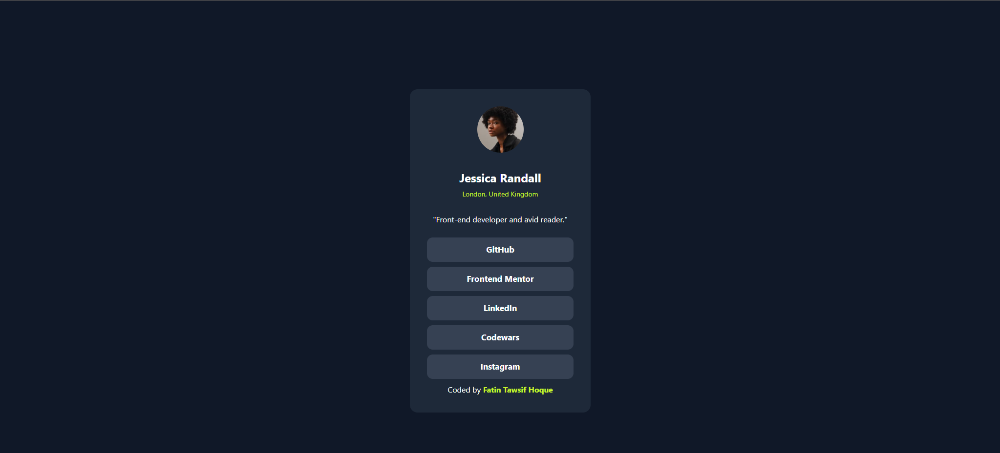
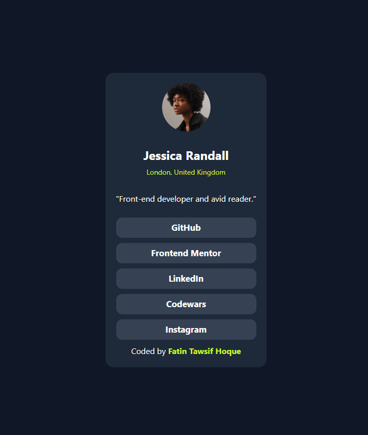
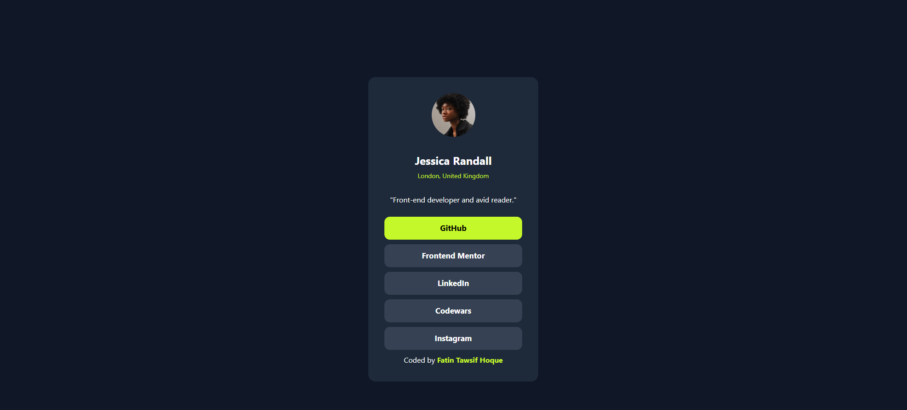

# Profile Card Component

A clean and responsive profile card built with **plain HTML** and **Tailwind CSS**, created as a solution to the [Social links profile](https://www.frontendmentor.io/challenges/social-links-profile-UG32l9m6dQ) on Frontend Mentor.

![Preview]
Desktop View - 
mobile View - 
Active Status View - 

## ✨ Features
- Fully responsive layout (mobile & desktop)
- Hover effects on social links
- Modern color scheme with consistent spacing
- No JavaScript — pure HTML & Tailwind CSS

## 🛠️ Built With
- HTML5
- Tailwind CSS (via CDN or build process)
- Flexbox for layout

## 🚀 Live Demo
👉 [View Live on Netlify](https://your-deployed-link.netlify.app) <!-- replace with your link -->

## 🔗 Profile Links

All buttons on this card are live links that take you directly to my profiles:

- **GitHub** → [github.com/fatintawsifhoque](https://github.com/fatintawsifhoque)  
  (Daily JavaScript & PHP problem solving)
- **Frontend Mentor** → [frontendmentor.io/profile/fatintawsifhoque](https://www.frontendmentor.io/profile/fatintawsifhoque)  
  (Front-end coding challenges)
- **Codewars** → [codewars.com/users/fatintawsifhoque](https://www.codewars.com/users/fatintawsifhoque)  
  (JavaScript kata solutions)
- **LinkedIn** → [linkedin.com/in/fatintawsifhoque](https://www.linkedin.com/in/fatintawsifhoque)  
  (Professional profile)

> 💡 Click any button in the live demo to visit the corresponding profile!